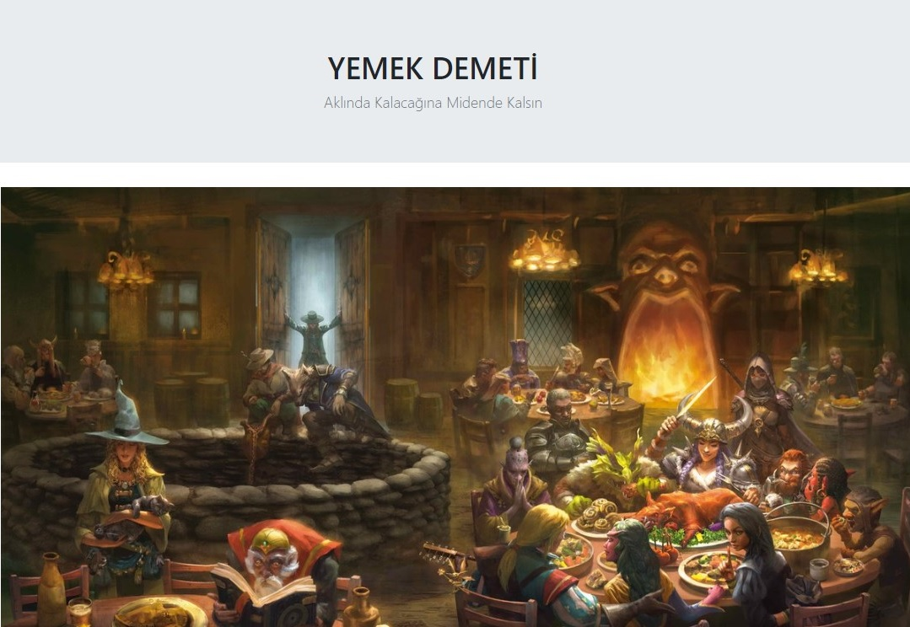
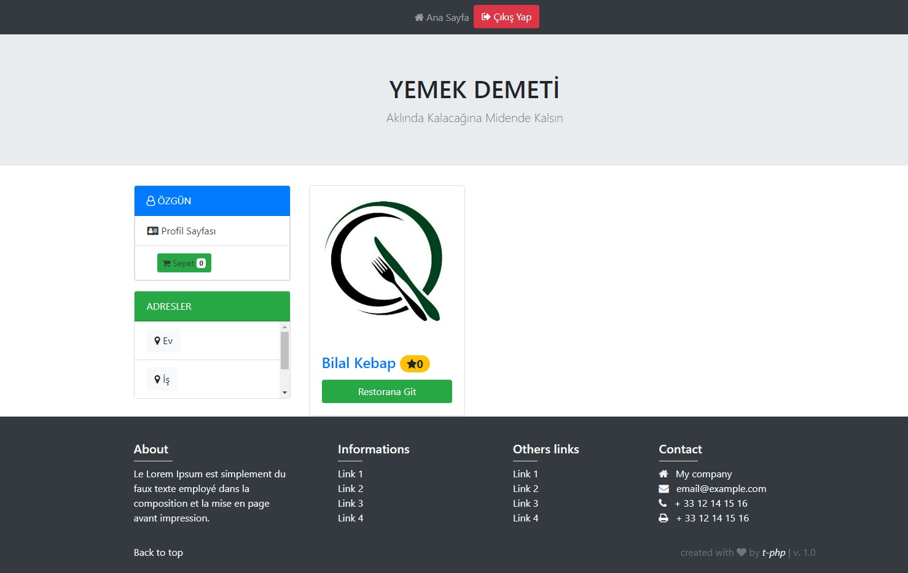
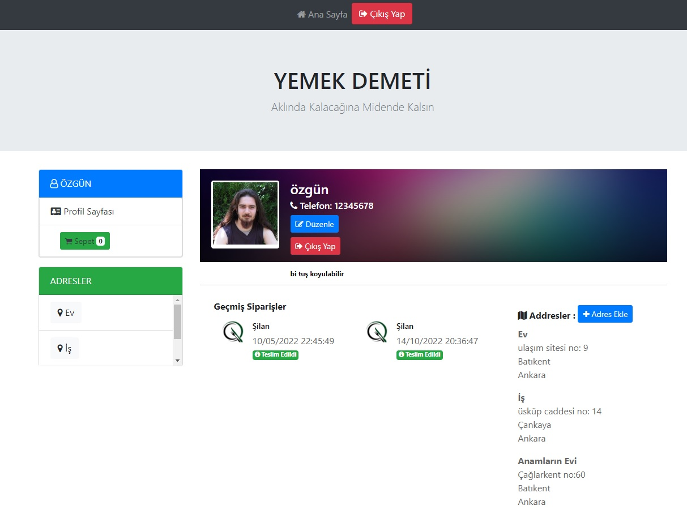
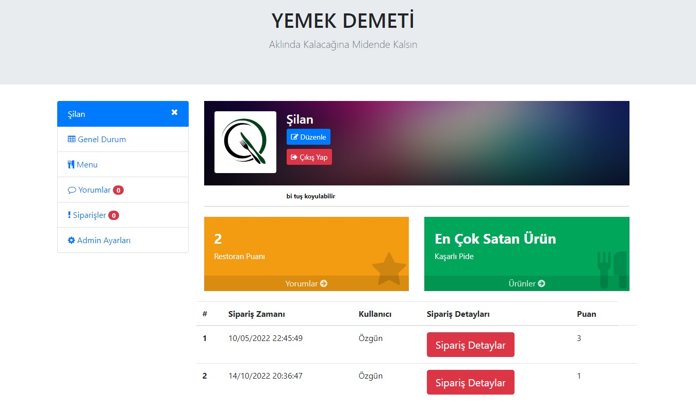
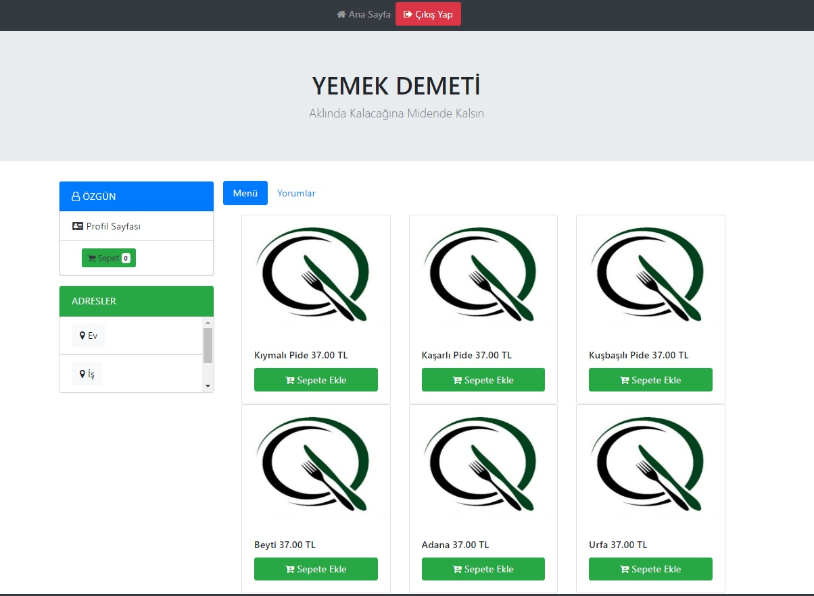

Bilge Adam Akademiden aldığım Full Stack Development (.Net Framework) eğitimi kapsamında bitirme projesi olarak geliştirdiğim MVC mimarisinde bir projedir.
Proje bir 'Yemek Sepeti' klonu olup içinde iki farklı rol (kullanıcı ve restoran admini) için iki örnek bulunuyor. (Projedeki fonksiyonları kullanarak yeni restoran, kullanıcı, adres, yeni yemek vs eklemek mümkün)

<h2> 🛠 &nbsp;Kullanılan Teknolojiler</h2>

<table style"float:right;">
  <tr>
    <td></td>
    <td></td>
    <td></td>
    <td></td>
    <td></td>
    <td></td>
    <td></td>
    <td></td>
    <td></td>
  </tr>
</table>

### 👤 Kullanıcı Rolü 

* Sipariş verme
* Adreslere göre restoran listeleme
* Geçmiş siparişlere yorum yapma ve puanlama
* Profil güncelleme (yeni adres, telefon profil resmi ekleme silme ve güncelleme)
#### Örnek Profil Kullanıcı adı: Özgün / Şifre: 123
#### Örnek Profil Kullanıcı adı: Damla / Şifre: 456

### 🧑‍🍳 Restoran Admin Rolü

* Gelen siparişlerin kontrolü
* Sipariş yorumlarının onayı
* Menüyü güncelleme (yemek ekleme, silme ve güncelleme)
#### Örnek Admin: ŞilanAdmin / Şifre : 123
#### Örnek Admin: BilalAdmin / Şifre : 456

### 🛠️ Projenin Kurulumu

  Porjeyi çalıştırmak için Microsoft Sql Server'ın bilgisayarınızda kurulu olması gerekmektedir.
  Projeyi açtıktan sonra Package Manager Console üzerinden **update-database** komutunu giriniz.
  Bu komut girildikten sonra SQL database içinde örnek veriler oluşturulacaktır.
  
  
## Adreslerin listelendiği sayfa (örnek olarak iki farklı restoran iki farklı bölgede listeleniyor)

## Profil sayfası

## Admin paneli

## Restoran Menü 

